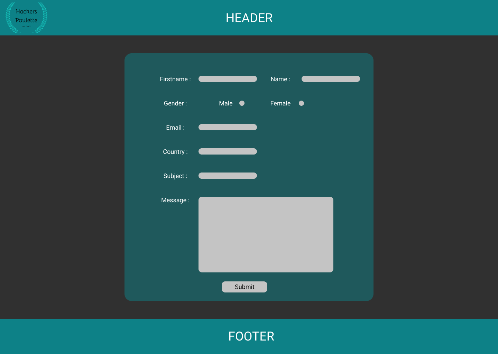
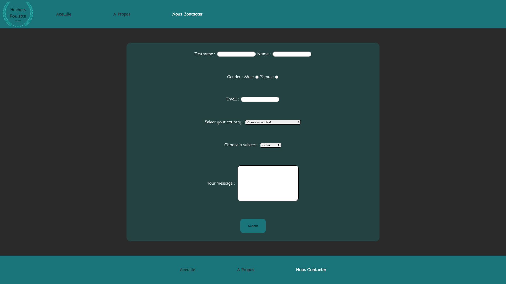

# Hackers Poulette

## The mission

The company _Hackers Poulette ™_ sells Raspberry Pi accessory kits to build
your own. They want to allow their users to contact their support team. Your
mission is to create a fully-functioning online "contact support" form, in *PHP*. 
It must *display a contact form* and *process the received answer* (sanitize, validate, answer the user).

There is a low-fidelity mock-up of the project:

This is a screenshot of the project:

## See the project

You can visit the web page via this url [Hackers Poulette by Giuseppe](https://hacker-poulette-form.herokuapp.com/) 
Hosted on [Heroku](https://www.heroku.com/)

## Library / Toolkit
* [Composer](https://getcomposer.org/) - Dependency manager software
* [Mailtrap](https://mailtrap.io/) - Email test environment
* [PHPMailer](https://github.com/PHPMailer/PHPMailer) - Software library for sending emails

## Image credit
* NA

## Author
* **Giuseppe Moi** _alias Github_ [@Giuseppemoi](https://github.com/Giuseppemoi)

